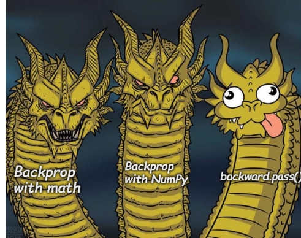

  

# Training Large Language Models from First Principles — Using Math and NumPy Only

## Training Large Language Models from First Principles — Using Math and NumPy Only

This project explores the training of large language models (LLMs) entirely from first principles, using only core mathematical operations and NumPy — without the aid of any deep learning frameworks.  
The goal is to offer both a practical and conceptual understanding of how LLMs work at the lowest level of abstraction.

---

### ✅ Why Take This Approach?

 🧠 Build an **intuitive understanding** of what’s going on under the hood.  
- ⚙️ The low-level logic is beautiful, once you get this, everything else (PyTorch, TensorFlow, Transformers) becomes **butter-smooth**.
- 🔁 Learning NumPy first makes transitioning to PyTorch seamless; they share similar operations and logic.
- 🛠️ You’ll become a **debugging master**; because you'll actually understand what each layer and step is doing.
---

## 🚀 Project Framework

All components are implemented using:
- 🐍 **Python**
- 🧮 **NumPy**
- ❌ No high-level machine learning libraries

This is a hands-on, code-first exploration designed to expose the mathematical anatomy of LLMs through implementation.

---

## 🗂️ Learning Roadmap

### 🔹 Part 1: Foundations — Linear and Logistic Regression

We begin with fundamental supervised learning algorithms to build intuition:
- A **one-dimensional linear regression** model  
- A **single-neuron logistic regression** model for binary classification

> 💡 **Need additional support?**  
> Refer to [this excellent YouTube playlist](https://youtube.com/playlist?list=PLeM4O8deP8GO3vIx_9eboO9tVpUKHYqRg&si=_qPsNeX3TuMZS9sf) by Professor Bryce for an in-depth visual guide.

 

**Mathematical Implementation Overview:**

  

---

### 🔸 Part 2: Neural Networks from Scratch

We then extend our models to multi-layer neural networks:
- A **single-input, two-layer fully connected neural network**
- A **multi-input variant**, capable of handling vectorized features
- All focused on **regression tasks**, enabling visual interpretability of outputs

#### 🧠 Single-Input Neural Network

  

#### 🧠 Multi-Input Neural Network

  

