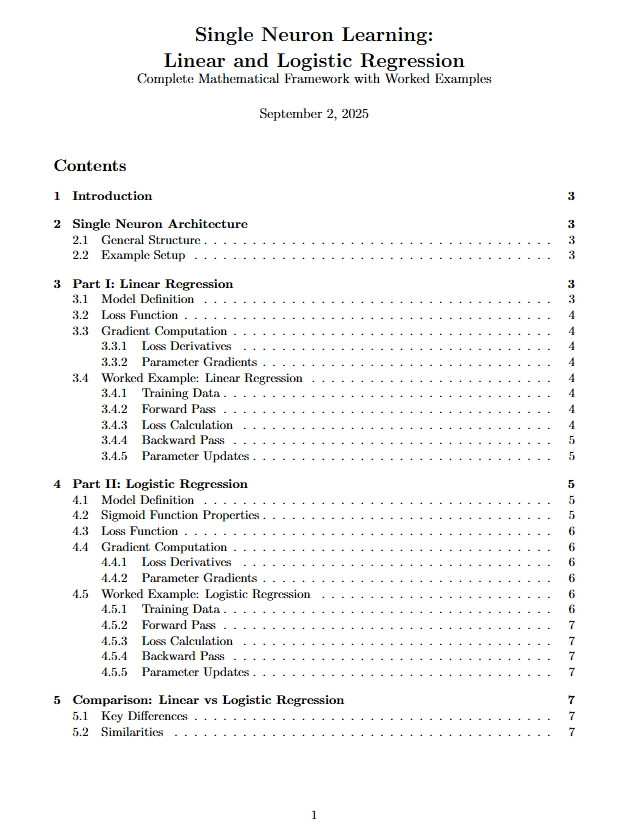
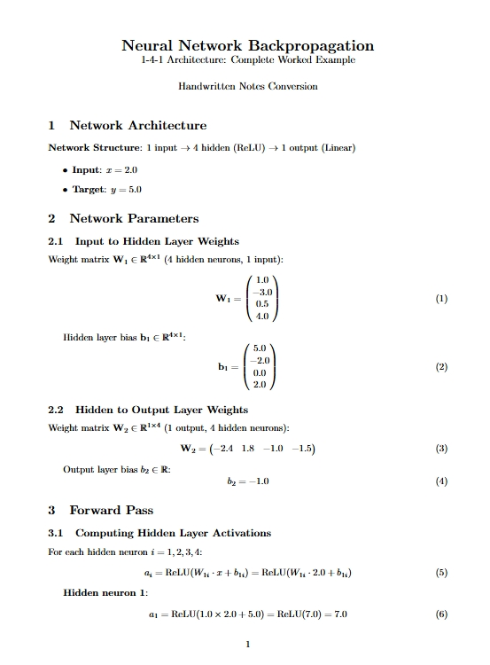
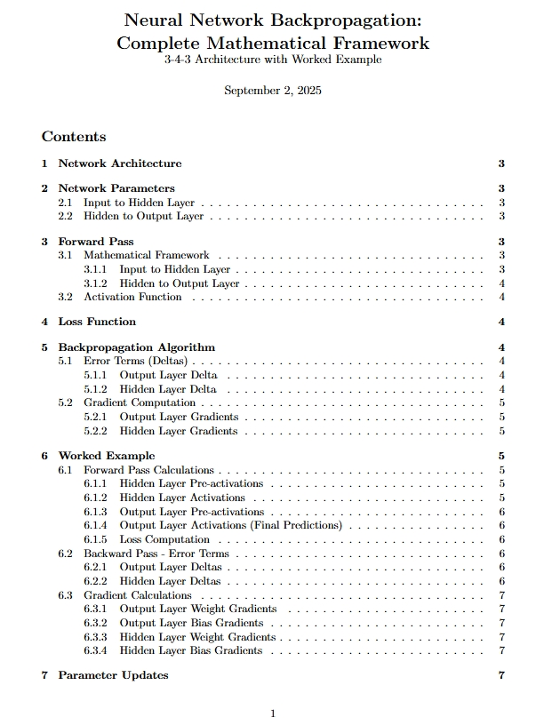

<div align="center">
  
</div>

<br><br>


## Training Large Language Models from First Principles — Using Math and NumPy Only

This project explores the training of large language models (LLMs) entirely from first principles, using only core mathematical operations and NumPy — without the aid of any deep learning frameworks.  
The goal is to offer both a practical and conceptual understanding of how LLMs work at the lowest level of abstraction.

---

###  Why Take This Approach?

- Build an **intuitive understanding** of what’s going on under the hood.  
- The low-level logic is beautiful, once you get this, everything else (optimizers, Transformers) becomes **butter-smooth**.
- Learning NumPy first makes transitioning to PyTorch seamless; they share similar operations and logic.
- You’ll become a **debugging master**; because you'll actually understand what each layer and step is doing.
---

##  Project Framework

All components are implemented using:
- **Python**
- **NumPy**
- ❌ No high-level machine learning libraries

This is a hands-on, code-first exploration designed to expose the mathematical anatomy of LLMs through implementation.

---

##  Learning Roadmap

###  Part 1: Foundations — Linear and Logistic Regression

We begin with fundamental supervised learning algorithms to build intuition:
- A **one-dimensional linear regression** model  
- A **single-neuron logistic regression** model for binary classification

>  **stuck or baffled?**  
> Refer to [this excellent YouTube playlist](https://youtube.com/playlist?list=PLeM4O8deP8GO3vIx_9eboO9tVpUKHYqRg&si=_qPsNeX3TuMZS9sf) by Professor Bryce for an in-depth visual guide.

<br>

***Mathematical Implementation Overview:***
 (click image for full PDF access)
<br><br>

<p align="center">
  <a href="main/brouillion.pdf">
    
  </a>
</p>


---

###  Part 2: Neural Networks from Scratch

We then extend our models to multi-layer neural networks:
- A **single-input, two-layer fully connected neural network**
- A **multi-input variant**, capable of handling vectorized features
- All focused on **regression tasks**, enabling visual interpretability of outputs

<br>

***Single-Input Neural Network*** \(click image for full PDF access\)

<br>


<p align="center">
  <a href="main/Meium.pdf">
    
  </a>
</p>

---

***Multi-Input Neural Network*** \(click image for full PDF access\)

<br><br>

<p align="center">
  <a href="main/paper.pdf">
    
  </a>
</p>


---


## Practice Exercise: Build It Yourself

Now, let's make sure that things have sunk in. Before tackling this exercise, make sure to review the code for the other cases we covered.

### Task

Recreate the **logistic regression** model, but this time apply it to a **new dataset**:

> ** Goal:** Predict college admission based on a student's SAT score.

---

###  Dataset

We'll use a small synthetic dataset for binary classification:

| SAT Score | Admitted |
|-----------|----------|
| 900       | 0        |
| 1100      | 0        |
| 1300      | 1        |
| 1500      | 1        |
| 1700      | 1        |

You can create it in NumPy as follows:

```python
import numpy as np

# Input features: SAT scores (reshaped to column vector)
X = np.array([[900], [1100], [1300], [1500], [1700]])


# Target labels: 0 = Not admitted, 1 = Admitted
y = np.array([0, 0, 1, 1, 1]).reshape(-1, 1)

